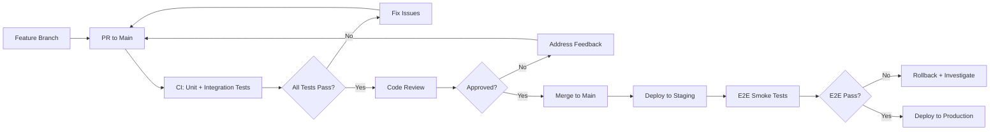

# Coding Standards

Owner: Ben Horner

## Design Patterns & Clean Code Philosophy

### Pragmatism Over Dogmatism

**Core Principle**: We love design patterns, but when faced with a choice between dogmatism and pragmatism, **choose pragmatism**.

Design patterns are tools to solve problems, not goals in themselves. Don’t force patterns where they don’t naturally fit or add unnecessary complexity just to maintain theoretical purity.

### Avoiding Over-Engineering

**Bad Example: Dogmatic Strategy Pattern**

```tsx
// Overly dogmatic - creating unnecessary abstractionclass PaymentProcessor {
    process(amount: number, method: string): string {
        const strategies = {
            'credit_card': this.processCreditCard,            'paypal': this.processPaypal,            'bank_transfer': this.processBankTransfer,            'cash': this.processCash, // Returns null but forces same interface        };        return strategies[method](amount);    }
    private processCreditCard(amount: number): string {
        // Complex credit card processing logic        return `Processed $${amount} via credit card`;    }
    private processPaypal(amount: number): string {
        // Complex PayPal integration        return `Processed $${amount} via PayPal`;    }
    private processBankTransfer(amount: number): string {
        // Complex bank transfer logic        return `Processed $${amount} via bank transfer`;    }
    private processCash(amount: number): string {
        // Cash doesn't need processing, but forced to return something        return null; // Violates the contract just to maintain abstraction    }
}
```

**Good Example: Pragmatic Approach**

```tsx
// Pragmatic - use patterns where they add valueclass PaymentProcessor {
    processCreditCard(amount: number): string {
        // Complex credit card processing logic        return `Processed $${amount} via credit card`;    }
    processPaypal(amount: number): string {
        // Complex PayPal integration        return `Processed $${amount} via PayPal`;    }
    processBankTransfer(amount: number): string {
        // Complex bank transfer logic        return `Processed $${amount} via bank transfer`;    }
    // No cash method needed - cash doesn't require processing    // Don't force unnecessary abstractions}
// Use strategy pattern only when it actually simplifies the codefunction processOnlinePayment(amount: number, method: string): string {
    const processor = new PaymentProcessor();    const onlineProcessors = {
        'credit_card': processor.processCreditCard.bind(processor),        'paypal': processor.processPaypal.bind(processor),        'bank_transfer': processor.processBankTransfer.bind(processor),    };    if (method in onlineProcessors) {
        return onlineProcessors[method](amount);    } else {
        throw new Error(`Unsupported online payment method: ${method}`);    }
}
```

### Design Pattern Guidelines

**When to Use Patterns:**

- **Solve Real Problems**: Use patterns to address actual complexity, not theoretical future needs
- **Improve Readability**: Pattern should make code easier to understand, not harder
- **Reduce Duplication**: Pattern should eliminate meaningful duplication, not create artificial interfaces
- **Enable Extension**: Use patterns when you genuinely need extensibility

**When to Avoid Patterns:**

- **Premature Abstraction**: Don’t abstract until you have at least 3 similar use cases
- **Forced Consistency**: Don’t make dissimilar things look similar just for pattern compliance
- **Over-Engineering**: Simple if/else statements are often better than complex pattern implementations
- **Pattern for Pattern’s Sake**: Don’t use patterns just because they exist

### Clean Code Principles

**Favor Clarity Over Cleverness:**

```tsx
// Clever but unclearconst users = users.filter(u => u.roles.some(r => r.name === 'admin'));// Clear and readableconst hasAdminRole = (user: User): boolean => {
    return user.roles.some(role => role.name === 'admin');};const adminUsers = users.filter(hasAdminRole);
```

**Simple Solutions First:**

```tsx
// Over-engineered for simple use case
interface Logger {
    log(message: string): void;
}

class ConsoleLogger implements Logger {
    log(message: string): void {
        console.log(message);
    }
}

class LoggerFactory {
    static create(): Logger {
        return new ConsoleLogger();
    }
}

// Simple and sufficient
const log = (message: string): void => {
    console.log(message);
};
```

**Rule of Three**: Don’t abstract until you have three similar implementations. Two might be coincidence, three indicates a pattern.

## Environment Strategy

### Core Philosophy

**Principle: Minimize environment drift and overhead while maintaining production fidelity**

We deliberately limit our environment strategy to reduce complexity, eliminate configuration drift, and accelerate delivery cycles. Each environment serves a specific, well-defined purpose.

### Environment Types

### Local Development Environment

- **Purpose**: Primary development and testing environment
- **Usage**: All feature development, debugging, and initial testing
- **Data**: Local databases, mock services, test data
- **Isolation**: Completely isolated per developer
- **Benefits**: Fast feedback loops, no shared resource conflicts

### Staging Environment

- **Purpose**: Production-like validation and smoke testing
- **Critical Rule**: **NO data mutation allowed**
- **Data**: Production data copy (refreshed every 24 hours)
- **Testing Type**: Smoke tests only - verify changes work in production-like conditions
- **State Management**: Maintained as close to production as possible
- **Access**: Automated E2E tests + limited manual verification

### Production Environment

- **Purpose**: Live customer-facing application
- **Access**: Automated deployments only
- **Monitoring**: Comprehensive observability and alerting

### Testing Strategy by Environment

### Local Development

```yaml
Testing Focus:  - Unit tests (100% coverage requirement for new code)  - Integration tests with mocked dependencies  - Component/module integration testing  - Performance profiling  - Security scanning
```

### CI Pipeline (Isolated Environments)

```yaml
Testing Focus:  - All unit tests  - Integration tests with real dependencies  - Rigorous edge case testing  - Security vulnerability scanning  - Performance regression testing  - Database migration testing
```

### Staging Environment

```yaml
Testing Focus:  - E2E smoke tests only  - Critical user journey validation  - Production configuration verification  - Performance baseline confirmation  - NO edge case testing  - NO data manipulation testing
```

### Deployment Workflow

### Standard Flow



### Quality Gates

1. **PR Creation**: Unit and integration tests pass in CI
2. **Code Review**: Minimum 2 approvals required
3. **Merge**: All CI checks must be green
4. **Staging Deploy**: Automated deployment triggers E2E tests
5. **Production Deploy**: Only after staging validation passes

### No Dedicated Dev Environment

**Rationale:**
- **Reduces Overhead**: No additional infrastructure to maintain
- **Eliminates Drift**: Fewer environments = fewer configuration differences
- **Faster Delivery**: Simplified deployment pipeline
- **Cost Effective**: Lower infrastructure costs
- **Forces Good Practices**: Developers must write proper tests and use local environments

**Developer Workflow:**

```bash
# Standard development flowgit checkout -b feature/new-feature
# Develop locally with:# - Local database# - Mock external services# - Test data fixturesnpm run test:unit
npm run test:integration
git push origin feature/new-feature
# Create PR - CI handles the rest
```

### Serverless Pipeline Exception

**When Ephemeral Environments Are Allowed:**

Serverless architectures with complex event-driven workflows may require ephemeral development environments due to:

- **Emergent Behavior**: Complex interactions between services that are difficult to simulate locally
- **Event Timing**: Real-world timing and ordering of events
- **Resource Scaling**: Auto-scaling behavior that can’t be replicated locally
- **Third-party Integrations**: External services that require real network calls

### Approval Process

```yaml
Requirements:  - Technical justification document  - Team lead approval  - Architecture review  - Cost impact assessment  - Cleanup automation plan
```

### Implementation Guidelines

```yaml
Ephemeral Environment Specs:  - Spin-up time: < 10 minutes  - Auto-destroy: After 4 hours of inactivity  - Cost monitoring: Real-time alerts  - Local integration: Must connect to local development stack  - Isolated data: No shared resources with staging/production
```

### Example Use Cases

- **Event-driven pipelines**: Complex workflows with multiple Lambda functions
- **Real-time data processing**: Streaming data with timing dependencies
- **ML pipelines**: Training and inference workflows with GPU resources
- **Third-party integrations**: Payment processing, external APIs with webhooks

### Environment Configuration

### Configuration Management

```tsx
// Environment-specific configurationinterface EnvironmentConfig {
  environment: 'local' | 'staging' | 'production';  database: DatabaseConfig;  apiUrls: Record<string, string>;  featureFlags: Record<string, boolean>;  logging: LoggingConfig;}
// Never commit environment-specific valuesconst config: EnvironmentConfig = {
  environment: process.env.NODE_ENV as any,  database: {
    url: process.env.DATABASE_URL!,    // ...  },  // ...};
```

### Secrets Management

- **Local**: `.env.local` files (gitignored)
- **Staging/Production**: Cloud provider secret management
- **CI**: Encrypted environment variables
- **Never**: Commit secrets to version control

### Monitoring and Observability

### Required Metrics by Environment

```yaml
Local:  - Development server health  - Test execution metrics  - Build performanceStaging:  - E2E test results  - Performance baselines  - Error ratesProduction:  - Full application metrics  - User behavior analytics  - Business KPIs  - SLA monitoring
```

### Benefits of This Strategy

**Speed:**
- Faster development cycles
- Reduced context switching
- Simplified deployment pipeline

**Quality:**
- Forces comprehensive local testing
- Production-like staging validation
- Clear separation of concerns

**Cost:**
- Lower infrastructure overhead
- Reduced operational complexity
- Efficient resource utilization

**Reliability:**
- Minimized configuration drift
- Predictable deployment process
- Clear rollback procedures

## Branching Strategy

### GitHub Flow

We follow the **GitHub Flow** branching strategy for all repositories.

**Core Principles:**

- `main` branch is always deployable
- Create feature branches from `main` for all new work
- Use descriptive branch names that reflect the work being done
- Open Pull Requests early for discussion and code review
- Deploy from feature branches for testing when needed
- Merge to `main` only after code review and all checks pass
- Deploy `main` immediately after merging

**Branch Naming Convention:**

```
feature/short-description
bugfix/issue-description
hotfix/critical-fix-description
```

**Examples:**

- `feature/user-authentication`
- `bugfix/payment-validation-error`
- `hotfix/security-vulnerability-patch`

## Commit Standards

### Conventional Commits

All commits **MUST** follow the [Conventional Commits](https://www.conventionalcommits.org/) specification.

**Format:**

```
<type>[optional scope]: <description>

[optional body]

[optional footer(s)]
```

**Types:**

- `feat`: A new feature
- `fix`: A bug fix
- `docs`: Documentation only changes
- `style`: Changes that do not affect code meaning (white-space, formatting, etc.)
- `refactor`: Code change that neither fixes a bug nor adds a feature
- `perf`: Code change that improves performance
- `test`: Adding missing tests or correcting existing tests
- `chore`: Changes to build process or auxiliary tools

**Examples:**

```
feat(auth): add JWT token validation
fix(payment): resolve null pointer exception in payment processor
docs(api): update authentication endpoint documentation
test(user): add unit tests for user registration
```

### Semantic Versioning (SemVer)

We use **Semantic Versioning** for all releases:

- `MAJOR.MINOR.PATCH` (e.g., `2.1.4`)
- **MAJOR**: Breaking changes
- **MINOR**: New features (backward compatible)
- **PATCH**: Bug fixes (backward compatible)

### Semantic Release

**Semantic Release** is used to automatically determine version numbers and generate releases based on commit messages.

**Configuration Requirements:**

- Automated version bumping based on conventional commits
- Automatic changelog generation
- Automated GitHub releases
- Integration with CI/CD pipeline

## Testing Requirements

### Unit Testing

**Requirement: 100% unit test coverage of unit testable code (new code)**

**Coverage Standards:**

- All business logic must have unit tests
- All utility functions must have unit tests
- All data transformation logic must have unit tests
- **Exclusions** from coverage must be documented and justified in PR description

**Exclusion Examples (must be documented):**

- Configuration files
- Database migration scripts
- Third-party integrations (covered by integration tests)
- Framework boilerplate code

**Testing Tools:**

- **TypeScript/JavaScript**: `vitest` with coverage reports

### Integration Testing

**Requirement: Integration tests for critical workflows with mocked or isolated dependencies**

**Standards:**

- Test interactions between components
- Mock external dependencies (APIs, databases, file systems)
- Focus on critical business workflows
- Use test containers for database testing when appropriate
- Maintain separate test configurations

**Tools:**

- **TypeScript**: `vitest` with mocking capabilities
- **Database**: Test containers or in-memory databases

### End-to-End (E2E) Testing

**Requirement: E2E tests for critical flows on staging environment**

**Environment Setup:**

- **Staging Database**: Production data copy refreshed every 24 hours
- **Test Isolation**: Tests must not interfere with each other
- **Critical Flows**: User registration, payment processing, core business workflows

**Tools:**

- **Web Applications**: Cypress

## Code Quality & Static Analysis

### TypeScript/JavaScript Standards

**Required Tools:**

- **Biome**: Fast linting and formatting for TS, JS, JSX, TSX, JSON
- **TypeScript**: Strict mode enabled
- **Bun**: Package management and runtime
- **Husky**: Git hooks for pre-commit checks

**Configuration:**

```json
// biome.json{  "$schema": "https://biomejs.dev/schemas/1.5.3/schema.json",  "organizeImports": {    "enabled": true  },  "linter": {    "enabled": true,    "rules": {      "recommended": true,      "complexity": {        "noExtraBooleanCast": "error",        "noMultipleSpacesInRegularExpressionLiterals": "error"      },      "correctness": {        "noConstAssign": "error",        "noGlobalObjectCalls": "error"      },      "suspicious": {        "noAsyncPromiseExecutor": "error",        "noMisleadingCharacterClass": "error"      }    }  },  "formatter": {    "enabled": true,    "indentStyle": "space",    "indentWidth": 2,    "lineWidth": 100  }}
```

**Git Hooks:**

- **Husky**: Manages Git hooks for TypeScript projects
- **Commitlint**: Enforces conventional commit format
- **Lint-staged**: Run biome on staged files

### Pre-commit Hooks

**TypeScript Projects:**

```json
// package.json{  "husky": {    "hooks": {      "pre-commit": "lint-staged",      "commit-msg": "commitlint -E HUSKY_GIT_PARAMS"    }  },  "lint-staged": {    "*.{ts,tsx,js,jsx,json}": ["biome check --apply"]  }}
```

## Pull Request Process

### PR Template Requirements

All repositories **MUST** include a PR template with the following sections:

```markdown
## DescriptionBrief description of changes
## Type of Change- [ ] Bug fix (non-breaking change which fixes an issue)
- [ ] New feature (non-breaking change which adds functionality)
- [ ] Breaking change (fix or feature that would cause existing functionality to not work as expected)
- [ ] Documentation update
## Testing- [ ] Unit tests added/updated
- [ ] Integration tests added/updated
- [ ] E2E tests added/updated (if applicable)
- [ ] Manual testing completed
## Code Coverage- [ ] Maintains 100% coverage of unit testable code
- [ ] Coverage exclusions documented below (if any)
### Coverage ExclusionsList any exclusions from coverage requirements with justification:
- File/function: reason for exclusion
## Security- [ ] Biome checks passed (TypeScript/JavaScript)
- [ ] No sensitive data exposed
- [ ] Authentication/authorization properly implemented
## Code Quality- [ ] Biome linting and formatting passed (TypeScript/JavaScript)
- [ ] Pre-commit hooks passing
## Checklist- [ ] Code follows conventional commit format
- [ ] Pre-commit hooks passing
- [ ] All tests passing in CI/CD pipeline
- [ ] Documentation updated (if needed)
- [ ] Breaking changes documented
```

### Review Requirements

- **Minimum 2 approvals** for production code
- **1 approval** required from code owner
- **All CI checks must pass** before merge
- **No direct pushes** to `main` branch

## Pipeline Requirements

### CI/CD Pipeline Testing

**Required Test Execution in Pipeline:**

1. **Unit Tests**: Run on every commit
2. **Integration Tests**: Run on every PR
3. **E2E Tests**: Run on merge to main and scheduled runs
4. **Security Scans**: Run on every commit
5. **Code Quality Checks**: Run on every commit

**Pipeline Structure:**

```yaml
# Example GitHub Actions workflowname: CI/CD Pipelineon: [push, pull_request]jobs:  typescript-quality:    runs-on: ubuntu-latest    steps:      - uses: actions/checkout@v4      - uses: oven-sh/setup-bun@v1      - name: Install dependencies        run: bun install      - name: Run biome checks        run: bun run biome check .  unit-tests:    runs-on: ubuntu-latest    steps:      - name: Run unit tests      - name: Generate coverage report      - name: Enforce coverage threshold  integration-tests:    runs-on: ubuntu-latest    steps:      - name: Run integration tests      - name: Upload test results  e2e-tests:    if: github.ref == 'refs/heads/main'    runs-on: ubuntu-latest    steps:      - name: Deploy to staging      - name: Run E2E tests
```

**Quality Gates:**

- Unit test coverage must meet 100% threshold (for new code)
- Biome linting and formatting checks must pass (TypeScript/JavaScript)
- Integration tests must pass
- E2E tests must pass (for main branch merges)

## Code Documentation

### Comments Philosophy

**Core Principle**: If you feel the need to write an inline comment, extract that logic into a well-named function instead.

**Preferred Approach:**

```tsx
// Bad: Inline comment explaining what the code does// Calculate compound interest using the formula A = P(1 + r/n)^(nt)const result = principal * (1 + annualRate / compoundsPerYear) ** (compoundsPerYear * years);// Good: Extract to a descriptive functionconst calculateCompoundInterest = (principal: number, annualRate: number, compoundsPerYear: number, years: number): number => {
    // Calculate compound interest using the standard formula A = P(1 + r/n)^(nt)    return principal * (1 + annualRate / compoundsPerYear) ** (compoundsPerYear * years);};const result = calculateCompoundInterest(principal, annualRate, compoundsPerYear, years);
```

```tsx
// Bad: Inline comment explaining business logic
// Check if user has premium subscription and hasn't exceeded daily limit
if (user.subscription === 'premium' && user.dailyApiCalls < 1000) {
    processRequest();
}

// Good: Extract to a descriptive function
const canProcessPremiumRequest = (user: User): boolean => {
    return user.subscription === 'premium' && user.dailyApiCalls < 1000;
};

if (canProcessPremiumRequest(user)) {
    processRequest();
}
```

### When Comments Are Acceptable

**Limited cases where inline comments are justified:**

- **External API Quirks**: Document third-party API behavior that isn’t obvious
- **Performance Optimizations**: Explain non-obvious performance trade-offs
- **Regulatory Requirements**: Reference specific compliance rules or standards
- **Temporary Workarounds**: Document with issue numbers and removal dates

**Examples of Acceptable Comments:**

```tsx
// Stripe API requires amounts in cents, not dollarsconst stripeAmount = userAmount * 100;// TODO: Remove this workaround when issue #1234 is resolved (due: 2024-Q2)// PostgreSQL connection pooling bug requires manual connection refreshif (connectionAge > timedelta(hours: 1)) {
    refreshConnection();}
```

### Documentation Standards

**Required Documentation:**

- **README.md**: Setup instructions, architecture overview, deployment guide
- **API Documentation**: OpenAPI/Swagger specifications for all APIs
- **Architecture Decision Records (ADRs)**: For significant technical decisions
- Code Documentation and auto wiki update is earmarked for auto gen (where TS docstrings will be injected) but this is still in backlog
- Complex logic (the definition of this can be on an ad hoc, case by case basis in review) should be documented at the root package level in a docs sub directory, e.g. packages/frontend/docs/AGENT.md. For more granular detail feel free to create sub directories within this e.g. packages/frontend/docs/explore/EXPLORE_AGENT.md. If we have a convention of where this lives we can automatically update a static wiki site in CI.

## Function Parameter Count

**Guideline: Limit functions to 3 parameters or fewer**

- **0-1 parameters**: Ideal (niladic/monadic functions)
- **2 parameters**: Good (dyadic functions)
- **3 parameters**: Acceptable but requires careful consideration (triadic functions)
- **4+ parameters**: Avoid - indicates the function is likely doing too much

**When you have many parameters:**
- Group related parameters into objects/structs
- Consider if the function violates single responsibility
- Use parameter objects or configuration objects
- Split the function into smaller, more focused functions

```jsx
// Poorfunction createUser(name, email, age, address, phone, role, department) { }
// Betterfunction createUser(userInfo, contactInfo, organizationInfo) { }
// orfunction createUser(userProfile) { }
```

## Single Responsibility Principle (SRP)

**Definition: A function should have one reason to change**

### Core Guidelines:

- Each function should do **one thing** and do it well
- Functions should operate at the **same level of abstraction**
- Don’t mix **high-level business logic** with **low-level implementation details**
- Don’t mix **different concerns** (data access, business logic, formatting, etc.)

### Same Level of Abstraction:

```jsx
// Poor - mixing abstraction levelsfunction processOrder(order) {
    // High level    validateOrder(order);    // Low level database details mixed in    const connection = mysql.createConnection(config);    connection.query('INSERT INTO orders...', order);    // High level    sendConfirmationEmail(order);}
// Better - consistent abstraction levelfunction processOrder(order) {
    validateOrder(order);    saveOrder(order);           // Hide DB implementation    sendConfirmationEmail(order);}
```

### Avoid Mixed Concerns:

- Don’t mix data validation with data persistence
- Don’t mix business logic with presentation logic
- Don’t mix error handling with core functionality

## Fail Fast Error Handling

**Philosophy: Detect errors early, let them propagate, handle them at appropriate boundaries**

### Core Principles:

1. **Validate inputs immediately** - fail at the boundary
2. **Don’t catch errors unless you can meaningfully handle them**
3. **Let errors bubble up** to appropriate handlers
4. **Use custom error types** for specific error scenarios
5. **Centralize error handling** at high levels of abstraction

### Implementation Pattern:

```jsx
// Low-level functions: validate and throwfunction withdrawMoney(account, amount) {
    if (amount <= 0) {
        throw new InvalidAmountError('Amount must be positive');    }
    if (account.balance < amount) {
        throw new InsufficientFundsError('Not enough funds');    }
    // Core logic here    account.balance -= amount;    return account;}
// Mid-level: let errors propagatefunction processWithdrawal(accountId, amount) {
    const account = getAccount(accountId); // May throw AccountNotFoundError    return withdrawMoney(account, amount);  // May throw withdrawal errors}
// High-level: catch and handle appropriatelyfunction handleWithdrawalRequest(request) {
    try {
        const result = processWithdrawal(request.accountId, request.amount);        return { success: true, data: result };    } catch (error) {
        if (error instanceof InsufficientFundsError) {
            logger.warn('Withdrawal failed: insufficient funds', {
                accountId: request.accountId,
                amount: request.amount
            });            return { success: false, error: 'Insufficient funds' };        }
        if (error instanceof InvalidAmountError) {
            logger.warn('Invalid withdrawal amount', { amount: request.amount });            return { success: false, error: 'Invalid amount' };        }
        // Unexpected errors bubble up to global handler        throw error;    }
}
```

### Custom Error Types:

```jsx
class DomainError extends Error {
    constructor(message, code) {
        super(message);        this.name = this.constructor.name;        this.code = code;    }
}
class ValidationError extends DomainError { }
class BusinessRuleError extends DomainError { }
class ResourceNotFoundError extends DomainError { }
```

## Flat Logic with Early Returns

**Goal: Eliminate nested conditions and improve readability**

### Guard Clauses Pattern:

```jsx
// Poor - nested logicfunction calculateDiscount(user, order) {
    if (user) {
        if (user.isPremium) {
            if (order.total > 100) {
                if (order.items.length > 5) {
                    return order.total * 0.15;                } else {
                    return order.total * 0.10;                }
            } else {
                return order.total * 0.05;            }
        } else {
            return 0;        }
    } else {
        throw new Error('User required');    }
}
// Better - early returnsfunction calculateDiscount(user, order) {
    if (!user) {
        throw new ValidationError('User required');    }
    if (!user.isPremium) {
        return 0;    }
    if (order.total <= 100) {
        return order.total * 0.05;    }
    if (order.items.length > 5) {
        return order.total * 0.15;    }
    return order.total * 0.10;}
```

### Benefits of Early Returns:

- **Reduces cognitive load** - fewer nested conditions to track
- **Makes error conditions explicit** - guard clauses at the top
- **Improves readability** - linear flow of logic
- **Easier to test** - clear paths through the function
- **Self-documenting** - preconditions are obvious

### Guidelines:

- Handle error/invalid cases first with early returns
- Use guard clauses for precondition validation
- Avoid else statements when possible
- Keep the “happy path” as the main flow of the function

## Pull Request Size Guidelines

**Rule: If your PR looks too big, sub-task your Linear ticket**

### Size Limits:

- **Ideal**: 200-400 lines of changes
- **Maximum**: 800 lines of changes
- **Red flag**: 1000+ lines requires justification

### When to Split:

- **Multiple features** - each feature should be its own PR
- **Refactoring + new features** - separate refactoring from feature work
- **Database migrations + code changes** - split schema changes from application logic
- **Multiple components/modules** - break down by logical boundaries

### How to Sub-task in Linear:

1. **Break down the original ticket** into smaller, focused tasks
2. **Each sub-task should be independently deployable** when possible
3. **Create clear dependencies** between sub-tasks in Linear
4. **Use descriptive sub-task titles** that explain the specific change
5. **Link related sub-tasks** in PR descriptions

### Benefits of Smaller PRs:

- **Faster review cycles** - easier for reviewers to understand
- **Reduced merge conflicts** - less time between creation and merge
- **Easier rollbacks** - granular changes are easier to revert
- **Better testing** - focused changes are easier to test thoroughly
- **Improved code quality** - reviewers can focus on details

### Exceptions:

- **Auto-generated code** (migrations, API clients)
- **Large data files** or configuration updates
- **Dependency updates** with extensive lock file changes
- **Critical hotfixes** (but still prefer smaller changes when possible)

## Import Aliasing Guidelines

**Rule: Use absolute imports with aliases rather than relative imports**

### Configure Path Aliases:

```jsx
// tsconfig.json or jsconfig.json{
  "compilerOptions": {
    "baseUrl": ".",    "paths": {
      "@/*": ["src/*"],      "@/components/*": ["src/components/*"],      "@/utils/*": ["src/utils/*"],      "@/services/*": ["src/services/*"],      "@/types/*": ["src/types/*"],      "@/hooks/*": ["src/hooks/*"],      "@/store/*": ["src/store/*"],      "@/assets/*": ["src/assets/*"]
    }
  }
}
```

### Usage Examples:

```jsx
// Poor - relative importsimport Button from '../../../components/ui/Button';import { validateEmail } from '../../utils/validation';import { UserService } from '../../../services/UserService';// Better - aliased importsimport Button from '@/components/ui/Button';import { validateEmail } from '@/utils/validation';import { UserService } from '@/services/UserService';
```

### Benefits:

- **No brittle relative paths** - moving files doesn’t break imports
- **Clearer intent** - immediately obvious where imports come from
- **Easier refactoring** - IDE tools work better with absolute paths
- **Consistent structure** - enforces organized project architecture
- **Better readability** - no need to count `../` to understand location

### Alias Naming Conventions:

- **@/** - Root src directory
- **@/components/** - UI components
- **@/utils/** - Utility functions
- **@/services/** - API services and business logic
- **@/types/** - TypeScript type definitions
- **@/hooks/** - Custom React hooks
- **@/store/** - State management
- **@/assets/** - Static assets

## Function Declaration Style

**Rule: Favor arrow functions as the default choice**

### Why Arrow Functions:

- **Lexical `this` binding** - inherit `this` from enclosing scope (no surprises)
- **Cleaner syntax** - more concise, especially for short functions
- **Predictable behavior** - no hoisting complications
- **Functional programming friendly** - work naturally with array methods

### Default Usage:

```jsx
// Preferred - arrow functionsconst calculateTotal = (items) => {
    return items.reduce((sum, item) => sum + item.price, 0);};const handleSubmit = async (data) => {
    const result = await apiService.submit(data);    return result;};// Array methodsconst activeUsers = users.filter(user => user.isActive);const userNames = users.map(user => user.name);
```

### Use Regular Functions When:

- **Need function hoisting** - function must be called before declaration
- **Constructor functions** - require their own `this` context
- **Object methods** - when you need `this` to refer to the object
- **Need `arguments` object** - though rest parameters (`...args`) are preferred

```jsx
// Regular function casesfunction initializeApp() {
    // Can be called before declaration due to hoisting}
const userService = {
    name: 'UserService',    // Regular function needed for 'this' context    getName: function() {
        return this.name;    }
};
```

### Benefits:

- **Consistent `this` behavior** - reduces debugging time
- **More readable** - especially in functional programming patterns
- **Modern JavaScript standard** - aligns with current best practices

## Type Organization

**Rule: Favor colocation where possible, order by creation when separated**

### Colocation First:

Keep types close to where they’re used rather than in separate type files when possible.

```tsx
// user-service.tsinterface User {
    id: string;    name: string;    email: string;}
interface CreateUserRequest {
    name: string;    email: string;}
export class UserService {
    async createUser(request: CreateUserRequest): Promise<User> {
        // Implementation    }
}
```

### When to Separate Types:

- **Shared across multiple modules** - types used in 3+ different files
- **Complex domain models** - large interfaces with many properties
- **API contracts** - request/response types shared between frontend/backend
- **Utility types** - generic helpers used throughout the application

### Separated Type Organization:

When types must be in separate files, **order by creation date** rather than alphabetical or logical grouping.

```tsx
// types/user.ts (created first)export interface User {
    id: string;    name: string;    email: string;}
// types/order.ts (created second)export interface Order {
    id: string;    userId: string;    total: number;}
// types/product.ts (created third)export interface Product {
    id: string;    name: string;    price: number;}
// types/index.ts - export in creation orderexport { User } from './user';export { Order } from './order';export { Product } from './product';
```

### Benefits of Creation Ordering:

- **Objective and consistent** - no subjective decisions about grouping
- **Reflects evolution** - shows how the codebase developed
- **Avoids reorganization** - no need to constantly reorder files
- **Git-friendly** - new types added at the end, minimal diffs

### File Structure:

```
src/
  components/
    UserCard/
      UserCard.tsx        # Component and local types together
      index.ts
  services/
    user-service.ts       # Service with related types
  types/
    index.ts             # Shared types only, ordered by creation
    user.ts              # Created: 2024-01-15
    order.ts             # Created: 2024-01-22
    product.ts           # Created: 2024-02-03
```

## Enforcement

### Automated Enforcement

- **Pre-commit hooks** prevent non-compliant commits
- **CI/CD pipelines** block merges that don’t meet standards
- **Branch protection rules** enforce review requirements
- **Semantic release** ensures consistent versioning

### Team Responsibilities

- **Developers**: Follow all standards and review peers’ code thoroughly
- **Tech Leads**: Ensure standards are understood and applied consistently
- **DevOps**: Maintain and improve automation tools and pipelines

### Non-Compliance Handling

1. **Automated Rejection**: Non-compliant code automatically rejected by CI/CD
2. **Code Review**: Manual review catches standards violations
3. **Training**: Team members receive additional training if needed
4. **Documentation Updates**: Standards updated based on team feedback and industry changes

## **GraphQL Standards**

### **Nullable Fields by Default**

**Core Principle: Start with nullable fields on types. Reserve required fields for input types or args.**

**Rationale:**

- **Network Resilience**: Fields can fail due to database issues, network problems, or authorization failures
- **Backward Compatibility**: Converting nullable to non-nullable is a breaking change
- **Error Isolation**: Nullable fields allow partial results when some data is unavailable
- **Authorization Granularity**: Different fields may have different access permissions

**Implementation Guidelines:**

```graphql
# ✅ Good: Start with nullable fields
type User {
  id: ID!
  name: String
  email: String
  profile: UserProfile
  preferences: UserPreferences
}

# ❌ Avoid: Over-constraining with non-nullable fields
type User {
  id: ID!
  name: String!
  email: String!
  profile: UserProfile!  # What if profile creation fails?
  preferences: UserPreferences!  # What if preferences are not set?
}
```

**When to Use Non-Nullable Fields:**

- **Core Identifiers**: id, uuid, slug - these should always exist
- **Required Business Data**: Fields that are essential for the entity's identity
- **Computed Fields**: Values that are derived from other data and cannot fail
- **Guaranteed Relationships**: When you can guarantee the relationship exists

### **Lighthouse Directives Over Custom Resolvers**

**Core Principle: Prefer Lighthouse directives over custom resolvers for common patterns**

**Benefits:**

- **Consistency**: Standardized behavior across the codebase
- **Performance**: Optimized implementations with caching and batching
- **Maintainability**: Less custom code to maintain and test
- **Documentation**: Self-documenting schema with clear intent

**Directive Usage Examples:**

```graphql
# ✅ Good: Use Lighthouse directives
type Query {
  users: [User!]! @all
  user(id: ID! @eq): User @find
  postsByAuthor(authorId: ID! @eq): [Post!]! @all
}

type User {
  posts: [Post!]! @hasMany
  profile: UserProfile @belongsTo
  roles: [Role!]! @belongsToMany
}

type Mutation {
  createUser(input: CreateUserInput!): User! @create
  updateUser(id: ID!, input: UpdateUserInput!): User! @update
  deleteUser(id: ID!): User! @delete
}
```

**When to Use Custom Resolvers:**

- **Complex Business Logic**: Operations that don't fit standard CRUD patterns
- **External API Integration**: Data from third-party services
- **Aggregations**: Complex calculations or data transformations - can still use custom directives
- **Authorization Logic**: Custom permission checks beyond @can* directives

### **Performance Considerations**

**Use Eager Loading to Prevent N+1 Queries:**

```graphql
# ❌ Bad: N+1 query problem
type Query {
  users: [User!]! @all  # 1 query for users
}

type User {
  posts: [Post!]! @hasMany  # N queries for each user's posts
}

# ✅ Good: Eager loading prevents N+1
type Query {
  users: [User!]! @all @with(relation: "posts")
}

type User {
  posts: [Post!]! @hasMany
}
```

**Implement Field-Level Caching:**

```graphql
type Query {
  expensiveCalculation: Int! @cache(maxAge: 3600)
  userStats: UserStats! @cache(maxAge: 300)
}
```

**Use Pagination for Large Lists:**

```graphql
type Query {
  posts(first: Int!, after: String): PostConnection! @paginate
}
```

```graphql
# ✅ Good: Use database indexes effectively
type Query {
  usersByRole(role: String! @eq): [User!]! @all
  coursesByProvider(providerId: ID! @eq): [Course!]! @all
}

# ✅ Good: Use scopes for complex filtering
type Query {
  publishedCourses: [Course!]! @all(scopes: ["published"])
  activeUsers: [User!]! @all(scopes: ["active"])
}
```

### **Security**

**Authorization:**

```graphql
# ✅ Good: Field-level authorization
type Query {
  user(id: ID!): User @can(ability: "view", find: "id")
  users: [User!]! @can(ability: "viewAny")
  adminStats: AdminStats! @can(ability: "viewAdminStats")
}

type Mutation {
  updateUser(id: ID!, input: UpdateUserInput!): User!
    @can(ability: "update", find: "id")
  deleteUser(id: ID!): User!
    @can(ability: "delete", find: "id")
}

# ✅ Good: Resource-specific permissions
type User {
  email: String! @can(ability: "viewEmail", find: "id")
  paymentInfo: PaymentInfo @can(ability: "viewPaymentInfo", find: "id")
  adminNotes: String @can(ability: "viewAdminNotes", find: "id")
}
```

**Input Validation:**

```graphql
# ✅ Good: Comprehensive input validation
input CreateUserInput {
  email: String! @rules(apply: [
    "email",
    "unique:users,email",
    "max:255"
  ])
  password: String! @rules(apply: [
    "min:8",
    "regex:/^(?=.*[a-z])(?=.*[A-Z])(?=.*\d)(?=.*[@$!%*?&])[A-Za-z\d@$!%*?&]/"
  ])
  firstName: String! @rules(apply: ["max:255", "regex:/^[a-zA-Z\s]+$/"])
  lastName: String! @rules(apply: ["max:255", "regex:/^[a-zA-Z\s]+$/"])
  phone: String @rules(apply: ["regex:/^\+?[1-9]\d{1,14}$/"])
  dateOfBirth: Date @rules(apply: ["before:today", "after:1900-01-01"])
}

# ✅ Good: Custom validation rules
input UpdateProfileInput {
  bio: String @rules(apply: ["max:1000", "profanity"])
  website: String @rules(apply: ["url", "max:255"])
  socialLinks: JSON @rules(apply: ["social_links_format"])
}
```

---

**Rate Limiting and Abuse Prevention:**

```graphql
# ✅ Good: Apply rate limiting to expensive operations
type Mutation {
  createUser(input: CreateUserInput!): User!
    @throttle(name: "create_user", maxAttempts: 5, decayMinutes: 60)
  resetPassword(email: String!): Boolean
    @throttle(name: "password_reset", maxAttempts: 3, decayMinutes: 60)
  sendVerificationEmail: Boolean
    @throttle(name: "verification_email", maxAttempts: 3, decayMinutes: 15)
}
```

```graphql
# ✅ Good: Different security levels per environment
type Query {
  debugInfo: DebugInfo
    @can(ability: "viewDebugInfo")
    @hide(env: ["production"])
  internalMetrics: InternalMetrics
    @can(ability: "viewInternalMetrics")
    @hide(env: ["production"])
}
```

### **GraphQL Error Handling & Production Security**

**Core Principle: Never expose internal details in production**

**Rationale:**

- **Security**: Stack traces and debug messages expose system architecture and potential vulnerabilities
- **Privacy**: Internal error details may contain sensitive information
- **Professionalism**: Clean error responses build and maintain user trust

**Error Response Standards**

**Production Error Response:**

```json
{
  "errors": [
    {
      "message": "An error occurred while processing your request",
      "extensions": {
        "category": "internal"
      }
    }
  ]
}
```

**Development Error Response:**

```json
{
  "errors": [
    {
      "message": "Database connection failed",
      "extensions": {
        "debugMessage": "SQLSTATE[HY000] [2002] Connection refused",
        "category": "database",
        "trace": [
          {
            "file": "/app/vendor/laravel/framework/src/Illuminate/Database/Connection.php",
            "line": 664,
            "function": "connect"
          }
        ]
      }
    }
  ]
}
```

---

*This document is a living standard and should be updated as the team’s practices evolve and improve.*
